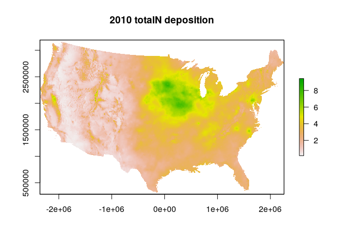

<!-- README.md is generated from README.Rmd. Please edit that file -->

## nadp

[](http://www.repostatus.org/#active)
[](https://travis-ci.org/jsta/nadp)

This package is an R interface to faciliate access to the National
Atmospheric Deposition Program map data.

## Installation

``` r
# install devtools if not found
# install.packages(devtools)
devtools::install_github("jsta/nadp")
```

## Usage

``` r
library(nadp)
library(raster)
#> Loading required package: sp
```

### Download external data and store in file system

``` r
nadp_get(years = 2010, products = "totalN")
```

### List files

``` r
nadp_ls()
```

### Load data

``` r
dt <- nadp_load(years = 2010, products = "totalN")
names(dt)
#> [1] "dep_totalN_2010"
class(dt)
#> [1] "RasterLayer"
#> attr(,"package")
#> [1] "raster"
plot(dt); title("2010 totalN deposition")
```

<!-- -->

## Contributing

Contributions welcome in the form of issues and pull requests.

## Prior Art

This package uses the `externalrdata` [package
template](https://github.com/jsta/externalrdata)
